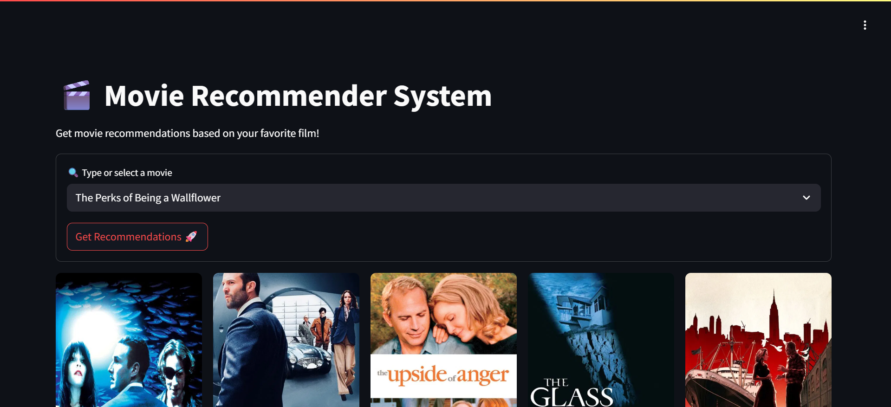

🎬 Movie Recommender System
A content-based movie recommendation web app that suggests similar movies based on your favorite film. Powered by NLP and cosine similarity, this app is built using Streamlit and leverages TMDB API to fetch dynamic poster content. Built with simplicity, learning, and functionality in mind.

🔍 Features
✅ Select a movie and get 5 similar recommendations

🖼️ Displays movie posters using the TMDB API

⚡ Fast recommendations using precomputed similarity matrix

💡 Clean and responsive UI built with Streamlit

🔗 Deployed easily via ngrok or locally in a Colab/Cloud environment

🛠️ Tech Stack
Tool/Library	Purpose
Python	Core programming language
Pandas	Data preprocessing and manipulation
Scikit-learn	Vectorization & similarity calculations
Streamlit	Front-end web app framework
Pickle	Model/data serialization
TMDB API	Poster and metadata fetching
Pyngrok	Exposing local server to public

📚 What I Learned
How to clean and preprocess data using Pandas

Applied CountVectorizer to extract important features from text

Built a content-based recommendation engine using cosine similarity

Integrated external APIs (TMDB) to enhance visual appeal

Deployed a working ML-powered web app using Streamlit

Learned practical error handling and optimization techniques while deploying in Google Colab
Start the app:

streamlit run app.py
🙌 Acknowledgements
TMDB API for movie data

Streamlit for simplifying ML app deployment

Scikit-learn for feature extraction & similarity
